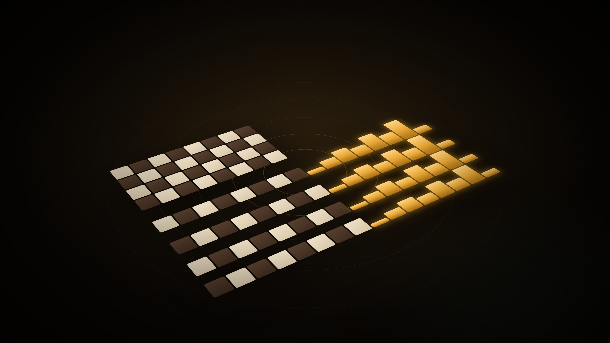
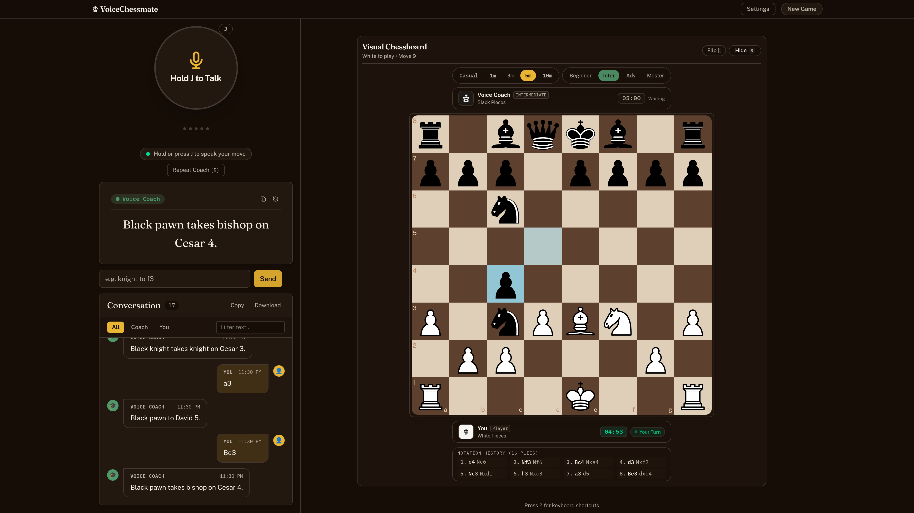
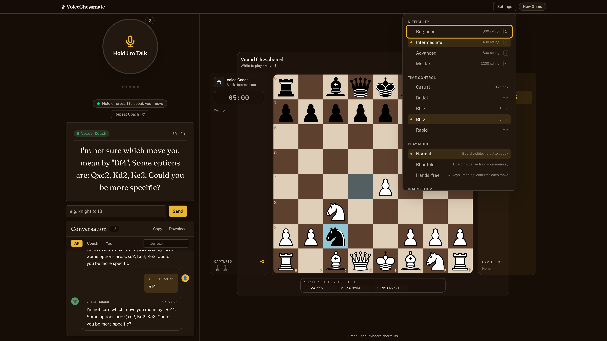
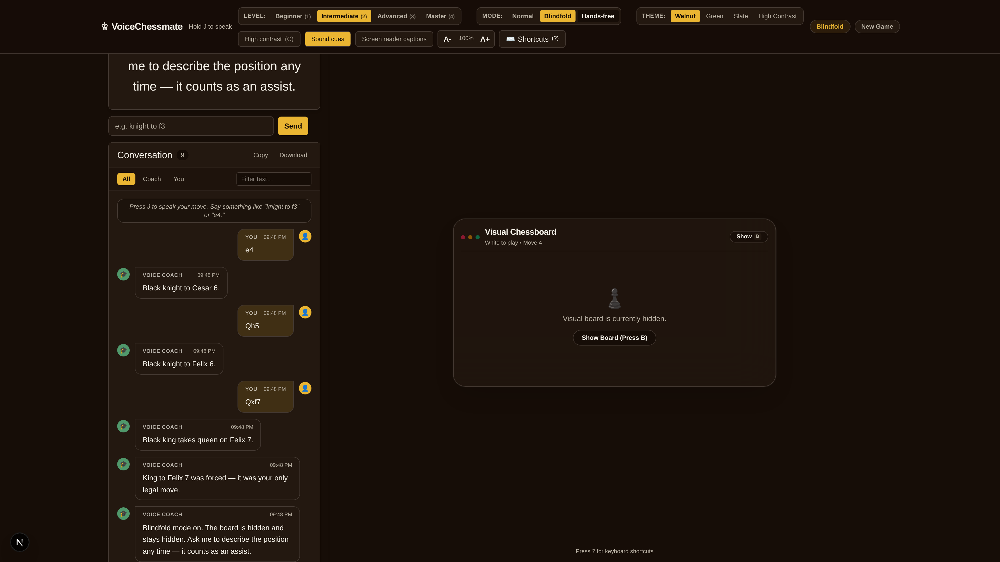
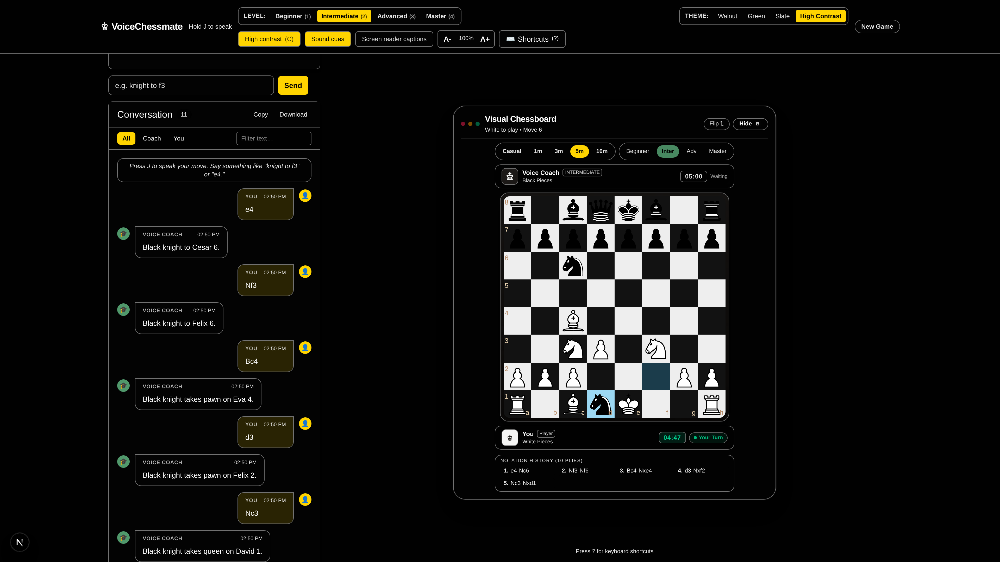

# chess.voice

> Play tournament chess entirely by voice — no screen, no mouse, no sighted help.

**[Play it live](https://chess-voice-weld.vercel.app)** . Built on the [AssemblyAI Voice Agent API](https://www.assemblyai.com/docs/voice-agents/voice-agent-api)

Press **J** and say a move. Plain notation works ("e4", "knight to f3"), and the
coach answers in the IBCA tournament alphabet blind players already use.



[](https://github.com/Aral-549/chess.voice/actions/workflows/ci.yml)
[](./LICENSE)
[](#verification)


<table>
<tr>
<td width="50%"></td>
<td width="50%"></td>
</tr>
<tr>
<td width="50%"></td>
<td width="50%"></td>
</tr>
</table>

[Pitch deck (PDF)](./assets/deck/chess.voice_Pitch_Deck.pdf) · [Submission copy](./assets/submission/SUBMISSION.md)

---

## The problem

There are an estimated **43 million blind people** and 295 million with
moderate-to-severe visual impairment worldwide. Chess is one of the few
competitive sports where they compete on genuinely equal terms — the IBCA
(International Braille Chess Association) runs world championships and
olympiads where blind and sighted play is identical in every respect but the
board.

But playing online is a different story. Mainstream chess platforms are built
around a drag-and-drop board. Screen readers announce a grid of 64 empty cells.
Keeping the position in your head while fighting the interface is the hard
part, and it has nothing to do with chess.

The existing workarounds are all compromises: a physical board plus a sighted
helper, a braille board you cannot share with a remote opponent, or a text
interface that requires memorising the entire position with no way to ask
about it.

**chess.voice removes the interface.** You speak your move. You hear what
happened. You can ask about the position the way you would ask a person sitting
across the board.

## What it does

```
You:    "knight to f3"
Coach:  "Knight f3. I'll play d5, challenging the centre."
You:    "what's attacking my queen?"
Coach:  "Nothing right now. Your queen on d1 is defended by the king."
You:    "describe the board"
Coach:  "White: king g1, rook f1, knight f3, pawns a2 b2 c2 f2 g2 h2..."
```

Every question is answered from the *real* position — the agent calls typed
tools against a deterministic chess engine rather than reasoning about the
board in natural language, so it cannot hallucinate a piece that isn't there.

## Why this is hard, and what we actually built

A voice chess app is not a thin wrapper over speech-to-text. Four problems had
to be solved.

### 1. A wrong move is worse than no move

This is the governing rule of the codebase. A sighted player who sees a wrong
move played can undo it instantly. A blind player may not discover the error
for several moves, by which point the game is unrecoverable.

So every uncertain interpretation is refused rather than guessed. Ambiguous
input ("knight takes" when two knights can capture) produces a clarifying
question, not a coin flip. `gameOverVerdict` returns *"say nothing"* rather
than a default when the outcome can't be determined. Move confirmation
thresholds are treated as a safety feature, not a UX preference.

### 2. Chess notation is hostile to speech recognition

"b" and "d" and "e" and "g" are near-indistinguishable over a microphone, and
that is exactly the alphabet chess uses. Getting `Bd3` wrong by one letter is a
legal-but-different move.

chess.voice speaks and understands the **1985 IBCA/FIDE phonetic alphabet**,
the standard used in official blind chess tournaments:

| File | a | b | c | d | e | f | g | h |
|------|---|---|---|---|---|---|---|---|
| Word | Anna | Bella | Cesar | David | Eva | Felix | Gustav | Hector |

"Eva four" is unambiguous where "e4" is not. This is not a gimmick — it is the
notation blind players already use, and it doubles as a phonetically-separated
vocabulary for the recogniser. All 8 file words plus piece names and command
verbs are registered as AssemblyAI **keyterms** to bias recognition toward them.

### 3. The agent must not be trusted with the rules

The LLM never decides whether a move is legal. It calls one of **14 typed
tools** against `chess.js`, and the engine's answer is authoritative:

`apply_move` · `describe_board` · `get_legal_moves` · `get_hint` · `undo_move`
· `set_difficulty` · `resign_game` · `set_premove` · `set_timer` ·
`adjust_timer` · `control_timer` · `control_board` · `control_settings` ·
`reset_game`

Castling, en passant, promotion, threefold repetition, and the fifty-move rule
are all enforced by the engine, not by the model's memory of the rules.

### 4. Audio on Linux is not one problem, it's two

The pipeline runs **two separate `AudioContext` instances**:

- **Capture** at 24 kHz — matches AssemblyAI's PCM16 streaming specification.
- **Playback** at the hardware's native 48 kHz — forcing 24 kHz output caused
  PulseAudio/PipeWire to silently mute the stream on Linux, which is precisely
  the platform many screen reader users are on.

Microphone audio flows through an `AudioWorklet` in 25 ms buffers, converts to
PCM16, and streams over the WebSocket. Agent audio is buffered and played back
gaplessly, with barge-in support so you can interrupt the coach mid-sentence.

## Architecture

```
  ┌────────────┐   PCM16 24kHz    ┌──────────────────────┐
  │  Microphone│ ───────────────► │  AssemblyAI          │
  │ AudioWorklet│   WebSocket     │  Voice Agent API     │
  └────────────┘                  │  ┌────────────────┐  │
                                  │  │ Streaming STT  │  │
  ┌────────────┐   agent audio    │  │ LLM routing    │  │
  │  Speaker   │ ◄─────────────── │  │ Voice output   │  │
  │ 48kHz ctx  │                  │  └────────────────┘  │
  └────────────┘                  └──────────┬───────────┘
                                             │ tool.call
                                             ▼
  ┌──────────────────────────────────────────────────────┐
  │  tool-handlers.ts  — 18 typed JSON-schema tools       │
  ├──────────────────────────────────────────────────────┤
  │  chess-engine.ts   — chess.js + minimax, authoritative│
  │  game-verdict.ts   — single owner of win/loss/draw    │
  │  announce.ts       — ARIA live regions (screen reader)│
  │  earcon.ts         — spatial stereo audio cues        │
  └──────────────────────────────────────────────────────┘
```

The browser never sees the AssemblyAI API key. `/api/token` mints a short-lived
token server-side (300 s TTL) against a **durable per-identity voice budget**
held in Postgres, origin-checked in production. See [SECURITY.md](./SECURITY.md)
and [docs/SETUP.md](./docs/SETUP.md).

## Accounts, saved games, and not going bankrupt

A public voice app is an open tap on your API credits unless something counts
what each caller takes. This one does.

- **Identity without signup.** Every visitor gets a signed, httpOnly device
  cookie. Judges and first-time players never see a login wall — the demo is
  fully playable anonymously, because a signup screen is a terrible thing to
  score a voice agent on.
- **A budget that actually holds.** Each mint reserves time against a daily
  allowance (30 min anonymous, 2 h signed-in), decremented under a row lock so
  two simultaneous requests cannot both spend the last of it. A single session
  is capped at 10 minutes, so a leaked token has a bounded cost. Every mint
  writes a ledger row, so spend is attributable to an identity.
- **Reserve, then refund.** A mint pessimistically reserves the full session
  length and hands back the difference when the client reports how long it
  actually ran. A client that reports nothing keeps the full reservation —
  silence costs the user, never the operator.
- **Sign-in is a magic link and nothing else.** No password field, no CAPTCHA,
  no social buttons. For a screen reader user a password flow means a hidden
  field, an unlabelled strength meter and errors that often never get announced.
  One labelled input, one button, status through a live region.
- **Games survive.** Position, move history and captured pieces are restored
  from PGN, and the resume is *announced* — a sighted player sees the board
  repopulate, everyone else has to be told. Losing a game in progress costs a
  blind player the position they were holding in memory, so this is an
  accessibility feature, not a convenience.
- **It degrades instead of failing.** With no database configured the app plays
  normally, hides the account panel entirely rather than offering a button that
  cannot work, and falls back to a weak in-process limiter that is explicitly
  labelled as such.

## Accessibility

Accessibility is the architecture here, not a compliance checkbox.

- **Keyboard-first.** Voice complements the keyboard; it never replaces it.
  Blind players are expert keyboard users, and speech recognition can mishear
  where a keypress cannot. Every feature has a keyboard path.
- **Screen reader native.** State changes are announced through ARIA live
  regions, which reach the user's screen reader instantly at the speech rate
  they have already tuned — rather than the app talking over it.
- **Spatial earcons.** Moves produce stereo-panned audio cues positioned by
  file, so board geometry is audible, not just describable.
- **No single-letter global shortcuts.** They collide with screen reader
  browse-mode quick keys and with algebraic notation. `role="application"` is
  scoped to the game area only, and move entry has its own field.
- **Visual accommodations.** Four themes including a high-contrast mode, font
  scaling, and no information conveyed by colour alone.

### Keyboard reference

| Key | Action |
|-----|--------|
| `J` (hold) | Speak your move or question |
| `Esc` | Cancel voice input |
| `R` | Repeat last coach message |
| `D` | Describe full board state |
| `T` | Hear active threats |
| `G` | Tactical summary |
| `U` | Undo last move |
| `B` | Show / hide visual board |
| `?` | Keyboard shortcuts reference |

## Quickstart

**Prerequisites:** Node.js 18+ and an
[AssemblyAI API key](https://www.assemblyai.com/dashboard/signup).

```bash
git clone https://github.com/Aral-549/chess.voice.git
cd chess.voice
npm install

cp .env.local.example .env.local   # add ASSEMBLYAI_API_KEY
npm run dev
```

Open <http://localhost:3000>. Chrome or Edge recommended — they have the most
reliable `AudioWorklet` and microphone support.

## Verification

```bash
npm test              # 626 tests across 31 files
npx tsc --noEmit      # strict typecheck
npm run lint
npm run build
```

All four run on every push and pull request via
[GitHub Actions](./.github/workflows/ci.yml).

Roughly **6,000 lines of tests against 10,000 lines of source** — including
adversarial suites that attack the chess engine with illegal input, malformed
agent protocol frames, contradictory game states, forged identity cookies and
hostile quota reports.

## Engineering discipline

This project is small but is built to assistive-software standards, because a
confidently wrong answer is the failure mode that matters:

- **[`contracts/`](./contracts)** — behaviour is specified as input → expected
  output tables *before* implementation. Where code and contract disagree, the
  contract is the specification and the code is the bug.
- **[`BUGLOG.md`](./BUGLOG.md)** — every bug is logged with its root cause and
  a permanent regression case. A fix without a regression case is not a fix.
  Unverified entries and known gaps are listed honestly rather than closed
  quietly.
- **Adversarial review.** Tests are never written in the same pass as the code
  they cover. Every regression case in this repo was verified to *fail* against
  the reintroduced bug before being accepted.
- **[`CONTRIBUTING.md`](./CONTRIBUTING.md)** — the full workflow.

## Roadmap

| Horizon | Work |
|---|---|
| Near term | Online play against other humans over WebRTC; PGN import/export by voice; Spanish and German IBCA phonetic sets |
| Medium | Opening trainer and tactics drills as spoken exercises; OTB tournament companion mode (announce your opponent's moves into the app) |
| Longer | Licensing the voice layer to existing chess platforms — the accessibility gap is theirs to close, and this is the missing component |

## Tech stack

| Layer | Technology |
|-------|-----------|
| Framework | Next.js 16 (App Router, Turbopack) |
| Language | TypeScript, strict mode |
| Voice | AssemblyAI Voice Agent API — streaming STT, TTS, turn detection, tool calling over WebSocket, PCM16 |
| Chess rules | chess.js |
| Engine | Minimax with alpha-beta pruning, 4 difficulty levels |
| Auth & data | Supabase — magic-link auth, Postgres, row level security |
| Audio | Web Audio API — dual AudioContext, AudioWorklet |
| Styling | Tailwind CSS |
| Tests | Vitest — 626 tests, 31 files |
| Hosting | Vercel |

## License

[MIT](./LICENSE). Built for the
[AssemblyAI Voice Agent Hackathon](https://lablab.ai/ai-hackathons/assemblyai-voice-agent-hackathon),
September 2026.
